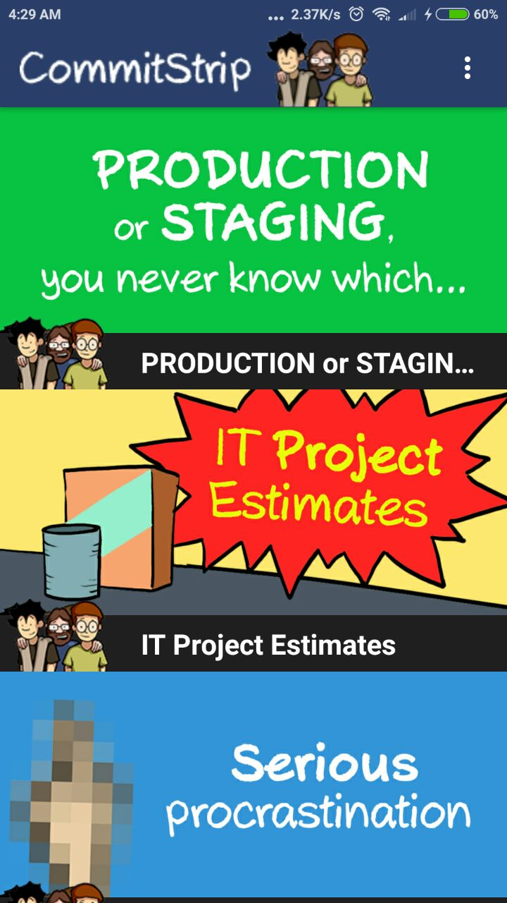
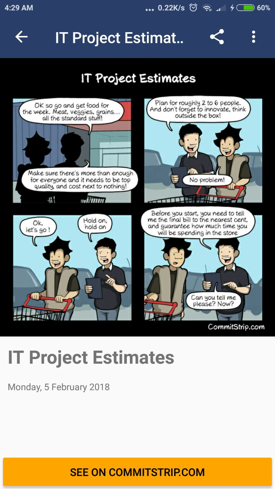
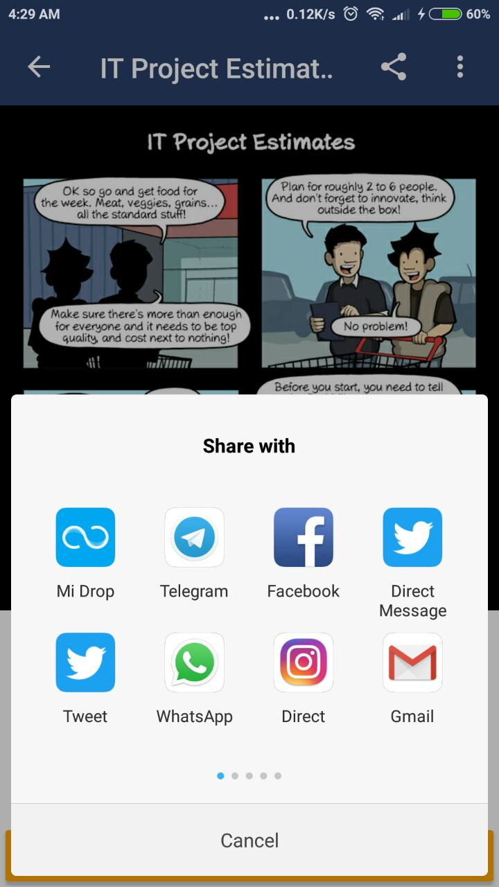

# Commit Strip React Native
A Commit Strip Reader built in React Native for iOS and Android

  

## Setup

Follow react native getting started guide : https://facebook.github.io/react-native/docs/getting-started.html

1. Clone the repo
2. `$ cd commit-strip-react-native`
3. Run either `$ yarn` or `$ npm install`

## Future Work

- [ ] Redux Integration
- [ ] Offline Support
- [ ] Search Feature
- [ ] Multilanguage Support
- [ ] Pin Last Readed Comic
- [ ] Sliding Comic Screen (Prev & Next)

## Contributing and License

### Issues

Feel free to submit issues and enhancement requests.

### Contributing

1. Fork the repo on GitHub
2. Clone the project to your own machine
3. Commit changes to your own branch
4. Push your work back up to your fork
5. Submit a Pull request so that we can review your changes

### License

Released under the MIT License. Check `LICENSE` file for more info.

&copy; 2018 by @rizalibnu